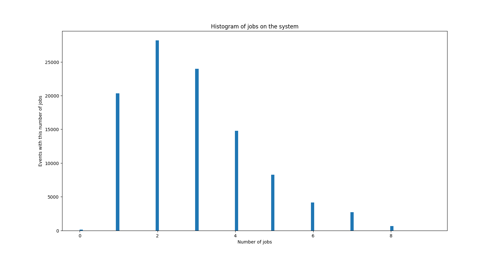
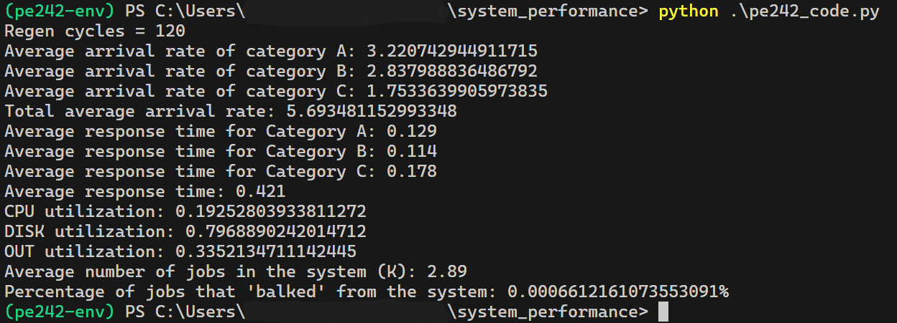

# Computational Systems Performance

## 1st Exercise

(TODO)

## 2nd Exercise

### Overview

In this exercise we simulated a system that consists of a CPU, a disk and a link
that sends traffic to the internet. Using the JWAT tool we were able to extract
from a given file with data the variable values that describe the system, such
as the average service time of each station, the average time of visits per job
to each station, the average arrival rate of jobs, as well as the percentage of
jobs that arrived from each category (3 job categories in total). Finally, we
calculated the arrival rate per job, the total response time of the system and
the response time per job category, the utilization degree of each station, and
finally the percentage of jobs that 'balked' from the system (more information
about balking mechanism can be found in the exercise).

### Step-by-step installation

1. **Clone the repository:**

   After you clone the repository with `git clone`, go in the directory of the
   project (`cd system-performance-ntua`).

2. **Python Virtual Environment (optional):**

   Creation:

   ```bash
   # Create Virtual environement
   python -m venv pe242-env
   ```

   Activation:

   ```bash
   # Windows
   pe242-env\Scripts\activate

   # macOS/Linux:
   source pe242-env/bin/activate
   ```

   Deactivation

   ```bash
   deactivate
   ```

3. **Install dependencies:**

   _Note: If you created a virtual environment, make sure you have activated it
   before installing the following dependencies._

   ```bash
   pip install numpy scipy matplotlib
   ```

### Usage

To run the simulation, execute the following command in your terminal:

```bash
python3 pe242_code.py
```

### Example

Below is an example of the simulation output.

#### **Graph**

The x-axis of the graph is the total number of jobs in the system and the y-axis
is the number of events that happend while the system had a total of x jobs.



#### **Text output**

A regenaration cycle is defined as the period between two events that the system was empty.



## Authors

- [Ioannis Giannoukos](https://github.com/urcodeboijorto574)
- [Argyro Tsipi](https://github.com/ArgyroTsipi)
